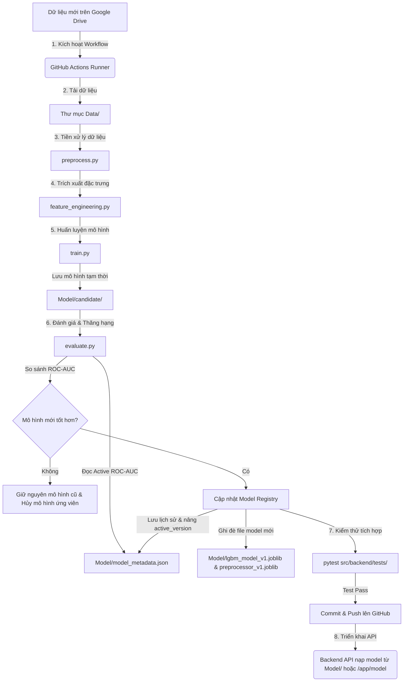

# 🚀 Dự đoán Rủi ro Vỡ nợ Tín dụng (Home Credit Default Risk)

### Hệ thống Machine Learning cho bài toán Phân loại Rủi ro Tín dụng & Đánh giá Năng lực Tài chính (End-to-End MLOps Pipeline)

**Tác giả:** Trần Nhật Minh 
**Vị trí:** Data Scientist / Data Analyst / Kỹ sư MLOps  
 

---

# 🌍 Bối cảnh bài toán

## 🏦 Mở rộng khả năng tiếp cận tài chính an toàn

Nhiều người dân gặp khó khăn trong việc vay vốn do không có đủ lịch sử tín dụng hoặc hồ sơ tài chính truyền thống. Các công ty tài chính như Home Credit muốn mở rộng dịch vụ đến nhóm khách hàng "unbanked" (chưa tiếp cận ngân hàng) này, nhưng đồng thời phải kiểm soát chặt chẽ rủi ro nợ xấu.

Để giải quyết vấn đề, Home Credit đã cung cấp một bộ dữ liệu khổng lồ bao gồm thông tin cá nhân, lịch sử ứng tuyển, và hành vi trả nợ từ các tổ chức tín dụng khác (Bureau) để dự đoán khả năng hoàn trả khoản vay của khách hàng.

**Thách thức chính:** *Làm thế nào để xây dựng một mô hình AI có thể tổng hợp dữ liệu từ 7 bảng độc lập, xử lý tình trạng mất cân bằng dữ liệu cực độ (92% trả đúng hạn - 8% vỡ nợ), đóng gói mô hình thành một API chuyên nghiệp và tích hợp vào giao diện ứng dụng thực tế?*

---

## 📊 Mô tả dữ liệu & cấu trúc hệ thống

Dataset bao gồm 7 bảng dữ liệu quan hệ chứa hàng chục triệu bản ghi, được liên kết với nhau qua mã khách hàng (`SK_ID_CURR`).

### 1. Cấu trúc hệ thống
Hệ thống AI xử lý tập trung vào 1 nhánh duy nhất:
- Nhánh **Phân loại nhị phân (Binary Classification)**: Dự đoán xác suất khách hàng vỡ nợ (1: Vỡ nợ, 0: Trả đúng hạn).

### 2. Các nguồn dữ liệu chính (6 Bảng Vệ Tinh)
- `application_train/test.csv`: Thông tin nhân khẩu học và khoản vay hiện tại.
- `bureau.csv`: Lịch sử khoản vay tại các ngân hàng/tổ chức tài chính khác.
- `previous_application.csv`: Lịch sử nộp đơn vay trong quá khứ tại Home Credit.
- `installments_payments.csv`: Lịch sử đóng tiền trả góp (có trễ hạn hay không).
- `POS_CASH_balance.csv`: Số dư và trạng thái các khoản vay tiền mặt/mua hàng.
- `credit_card_balance.csv`: Biến động số dư thẻ tín dụng hàng tháng.

---

### 3. Output
- **Target (Classification):** Xác suất vỡ nợ (từ 0.0 đến 1.0).
- Được sử dụng để sắp xếp thứ tự rủi ro và ra quyết định duyệt/từ chối tự động (Ngưỡng Threshold = 0.3).

---

# 📌 Tóm tắt hệ thống AI

Hệ thống gồm các bước:
- Phân tích dữ liệu (EDA) và nhận diện Data Imbalance.
- Tiền xử lý (Xử lý Outlier, Missing Values).
- Feature Engineering (Tạo biến tài chính, Gộp 6 bảng vệ tinh).
- Huấn luyện đa mô hình & Đánh giá (Logistic, Random Forest, LightGBM).

## 1️⃣ Phân tích dữ liệu (EDA)
- **Mất cân bằng lớp:** Dữ liệu cực kỳ lệch: 92% mẫu là Class 0, chỉ 8% là Class 1. Sử dụng metric **ROC-AUC**.
- **Ngoại lai:** Thay thế giá trị `365243` ngày trong `DAYS_EMPLOYED` bằng `NaN`.

## 2️⃣ Tiền xử lý & Feature Engineering
- **Domain Knowledge Features:** Tạo các chỉ số tài chính như `CREDIT_INCOME_PERCENT` (Tỷ lệ nợ/thu nhập), `ANNUITY_INCOME_PERCENT`.
- **Advanced Relational Aggregation:** Dùng `groupby` và `agg` để đúc kết hàng triệu dòng từ 5 bảng vệ tinh (tính Tổng nợ, Số ngày trễ hạn...).
- **Xử lý Missing:** Lấp đầy khoảng trống bằng thuật toán `SimpleImputer(strategy='median')`.

## 3️⃣ Mô hình & đánh giá
Quá trình Thử nghiệm Đa mô hình:
1. **Logistic Regression (Baseline):** Đạt ROC-AUC ~ 0.6925.
2. **Random Forest:** Đạt ROC-AUC ~ 0.7244.
3. **LightGBM (State-of-the-Art):** Tích hợp *Early Stopping*. Đạt ROC-AUC cao nhất ~ **0.7768**.

**Data Insights (Top Features):**
1. `EXT_SOURCE_1/2/3`: Điểm tín dụng từ tổ chức bên ngoài.
2. `BUREAU_TOTAL_DEBT`: Tổng số tiền đang nợ ở các ngân hàng khác.
3. `INSTAL_DPD_max`: Số ngày trả chậm tối đa trong quá khứ.
4. `AGE`: Tuổi của khách hàng.

---

# 🤖 Quy trình MLOps tự động hóa (End-to-End MLOps Pipeline)

Dự án tích hợp một hệ thống MLOps tự động hóa hoàn chỉnh từ khâu lấy dữ liệu, huấn luyện lại, đánh giá, kiểm thử cho đến thăng hạng và triển khai mô hình.

## Sơ đồ luồng hoạt động (Workflow từ A-Z)



## Các thành phần MLOps cốt lõi

### 1. Kích hoạt và Chuẩn bị Môi trường
- **Cơ chế kích hoạt**: Quy trình chạy tự động hàng quý (cron job) hoặc chạy thủ công bằng nút bấm **Run workflow** trên GitHub Actions.
- **Tải dữ liệu**: Dữ liệu thô mới nhất được kéo tự động từ Google Drive xuống thư mục `Data/` trên máy ảo của GitHub Runner.

### 2. Tiền xử lý & Huấn luyện đồng bộ
- Quy trình huấn luyện tự động tiền xử lý dữ liệu đồng bộ cấu trúc đặc trưng bằng cách giữ `DAYS_EMPLOYED_ANOM` là dạng boolean, thực hiện One-Hot Encoding cùng bộ lấp khuyết `SimpleImputer(strategy='median')` trực tiếp trên toàn bộ thuộc tính, đồng thời huấn luyện LightGBM Classifier với `early_stopping` (tương tự như trong Jupyter Notebook của bạn).

### 3. Đăng ký & Thăng hạng mô hình (Model Registry)
- Thư mục **`Model/`** đóng vai trò là **Model Registry (Single Source of Truth)** lưu trữ phiên bản mô hình chạy chính thức (`lgbm_model_v1.joblib`, `preprocessor_v1.joblib`) và tệp quản lý cấu hình `model_metadata.json`.
- Nếu mô hình mới tốt hơn hoặc bằng mô hình hiện tại, tệp cấu hình `model_metadata.json` sẽ tự động chuyển trạng thái mô hình cũ thành `"archived"` và cập nhật `"active_version"` mới (ví dụ: `v2`), đồng thời lưu giữ danh sách thuộc tính (`feature_names`, `num_cols`, `cat_cols`) để Backend nạp động.

### 4. Phục vụ mô hình & Triển khai (Serving & Deployment)
- **Kiểm thử tự động**: Trước khi lưu trữ mô hình mới, chạy bộ unit test `pytest src/backend/tests/` nhằm kiểm tra API nạp và dự đoán thành công.
- **Hạ tầng phục vụ**: 
  - Khi chạy cục bộ, API Backend tự động tìm đọc model từ thư mục gốc `Model/`.
  - Khi chạy trong container Docker (cả Dev và Production), thư mục gốc `Model/` được gắn (mount) dạng chỉ đọc (`readonly`) trực tiếp vào `/app/model` của container.
  - Khi người dùng gửi yêu cầu dự đoán, `ml_service.py` đọc tệp metadata để định hình và căn chỉnh đặc trưng (OHE alignment) đúng theo cấu trúc của phiên bản mô hình đang hoạt động hiện tại.

---

# 🚀 Production API & Giao diện (End-to-End)

Dự án không chỉ dừng lại ở Jupyter Notebook mà đã được đưa vào môi trường thực tế (Production) gồm Backend API và Frontend.

## 1. Hệ thống Backend API (Clean Architecture)
Hệ thống Backend API chuẩn MLOps được xây dựng bằng **FastAPI**, lưu vết chấm điểm bằng **PostgreSQL** và tổ chức theo chuẩn **Clean Architecture** (Dependency Injection, Service Layer, Repository Pattern).

- `app/api/`: Chứa Controllers/Routes (`/api/v1/predict`).
- `app/services/`: Lớp `MLService` nạp model LightGBM vào RAM (Singleton Pattern), tự động căn chỉnh (align) các biến Categorical (One-Hot Encoding) và tạo các biến phái sinh tài chính từ request của client trước khi predict.
- `app/repositories/`: Thao tác lưu lịch sử dự đoán xuống DB.
- `app/schemas/`: Pydantic Models để validate chặt chẽ dữ liệu đầu vào.

## 2. Giao diện Frontend (ReactJS)
- Ứng dụng ReactJS (cấu hình qua Vite) giúp nhân viên tín dụng nhập nhanh thông tin khách hàng qua UI chuyên nghiệp.
- Giao tiếp trực tiếp với Backend để trả về quyết định **APPROVE** (Xanh) hoặc **REJECT** (Đỏ).
- Hệ thống MLOps Dashboard cho phép xem lịch sử dự đoán và thông tin version của Model.

---

# ⚙️ Hướng dẫn Khởi chạy (Docker & Local)

Toàn bộ hệ thống Backend và Database có thể chạy hoàn toàn độc lập bằng Docker.

### Bước 1: Khởi chạy Backend & DB (Docker)
Mở Terminal tại thư mục `src/backend/` và chạy:
```bash
docker-compose up --build -d
```
Hệ thống sẽ chạy FastAPI và PostgreSQL. 
👉 **Tài liệu Swagger UI:** [http://localhost:8000/docs](http://localhost:8000/docs) (Hoặc port tương ứng trong docker-compose). Bạn có thể test trực tiếp API dự đoán tại đây.

### Bước 2: Khởi chạy Frontend (React)
Mở Terminal mới tại thư mục `src/frontend/`:
```bash
npm install
npm run dev
```
Truy cập vào link Localhost (thường là `http://localhost:5173`) để sử dụng ứng dụng.

---

# 🏁 Kết luận

Dự án đã xây dựng thành công một quy trình (Pipeline) Machine Learning khép kín từ khâu thu thập dữ liệu quan hệ phức tạp, tối ưu mô hình, cho đến việc đóng gói thành API chuẩn MLOps và tích hợp vào giao diện React. Việc áp dụng LightGBM kết hợp cùng Clean Architecture không chỉ mang lại độ chính xác cao mà còn đảm bảo hệ thống có khả năng scale, giúp ngân hàng tự động hóa và nâng cao năng lực xét duyệt hồ sơ vay.
